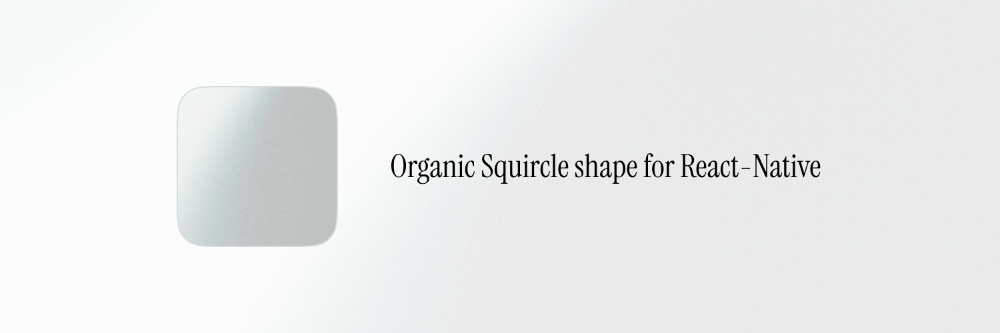

# Squircle shape renderer for React Native 10x faster than SVG based alternatives

This library hooks into the react-native `<View />` component native renderer for iOS and Android to change it's shape, so in the end a `FastSquircleView` is just a normal `View` with a different shape and you can expect close performance to a normal `View`

## ✨ Features

- 🚀 **Native Performance**: No SVGs involved, it's just a normal `<View />` just with a different shape
- 🎨 **Easily styleable**: Supports borders, outlines, shadows and `overflow: "hidden"` out of the box
- 📱 **Cross Platform**: Works on iOS and Android
- 🎛️ **Customizable**: Adjustable corner smoothing from sharp to very smooth
- 🧩 **Drop-in Replacement**: Compatible with all standard React Native View props

## 📦 Installation

```sh
npm install react-native-fast-squircle
```

```sh
yarn add react-native-fast-squircle
```

```sh
bun add react-native-fast-squircle
```

### Expo Setup

The package includes some native code so you won't be able to use it with Expo GO.

To use the package with expo run

```sh
expo prebuild
```

### iOS Setup

For iOS, you may need to run pod install:

```sh
cd ios && pod install
```

### Android Setup

No additional setup required for Android.

## 🚀 Usage

### Basic Example

```tsx
import React from 'react';
import SquircleView from 'react-native-fast-squircle';

export default function App() {
  return (
    <SquircleView
      style={{
        width: 200,
        height: 200,
        backgroundColor: 'tomato',
        borderRadius: 30,
      }}
      cornerSmoothing={0.6}
    />
  );
}
```

The `SquircleView` can be used exactly as a normale react-native `View` it just adds a new cornerSmoothing prop ranging between 0 and 1 where 0 is a normal rounded rect view and 1 is max corners smoothness (default value is 0.6)

## 🤝 Contributing

See the [contributing guide](CONTRIBUTING.md) to learn how to contribute to the repository and the development workflow.

## 📄 License

MIT © [fbeccaceci](https://github.com/fbeccaceci)

---

Made with ❤️ using [create-react-native-library](https://github.com/callstack/react-native-builder-bob)
